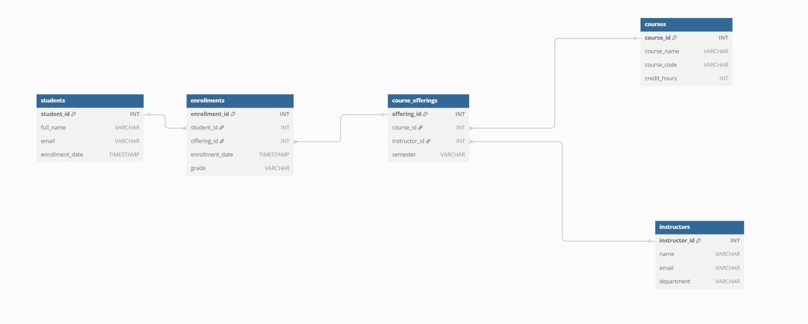

# 🎓 Student Course Enrollment System

A MySQL-based database system designed to manage student enrollments, courses, instructors, and semester offerings for an academic institution. This project demonstrates good relational database design using normalization (1NF, 2NF, 3NF) and proper SQL constraints.

---

## 📘 Project Overview

This database system allows:

- Storage of student, course, and instructor information
- Tracking of course offerings per semester
- Management of enrollments and grades
- Enforced data integrity using foreign keys and constraints

---

## 🛠️ Setup Instructions

### Requirements

- MySQL Server (e.g., via MySQL Workbench or CLI)
- A code editor (e.g., Visual Studio Code)

### Steps

1. Clone or download the project repository.
2. Open `answers.sql` in your SQL tool.
3. Execute the script to create and populate the database.

```bash
mysql -u your_username -p < answers.sql

```
--🧱 Database Structure
Tables:
students: Contains student details

courses: Lists all available courses

instructors: Stores instructor data

course_offerings: Tracks which course is offered in which semester by which instructor

enrollments: Records which students are enrolled in which course offering, along with grades

🔗 ERD Diagram
Below is the visual representation of the database structure:



